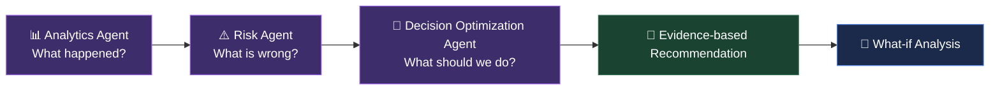

```markdown
<div align="center">

<a href="https://github.com/kedar765/EVORA">
  
</a>

*From Business Data to Evidence‑Based Decision Optimization*

</div>

---

> ⚠️ **EVORA does not execute business decisions.** It analyzes data, evaluates alternatives, and returns evidence‑based recommendations — the final decision always stays with the user.

---

## 📑 Table of Contents

- [Project Overview](#project-overview)
- [Project Goal](#project-goal)
- [Core Questions](#core-questions)
- [Key Features](#key-features)
- [AI Agents](#ai-agents)
- [Machine Learning vs AI Agents](#machine-learning-vs-ai-agents)
- [Risk Analysis](#risk-analysis)
- [Workflow](#workflow)
- [System Architecture](#system-architecture)
- [AI Agent Architecture](#ai-agent-architecture)
- [Technology Stack](#technology-stack)
- [Project Structure](#project-structure)
- [Input Data](#input-data)
- [Business Metrics](#business-metrics)
- [What‑if Analysis](#whatif-analysis)
- [Example Walkthrough](#example-walkthrough)
- [Reliability and Limitations](#reliability-and-limitations)
- [Evaluation](#evaluation)
- [Project Status](#project-status)

---

## Project Overview

**EVORA** (Enterprise Vision Optimizing Reasoning Assistant) is an AI‑powered **Business Intelligence and Decision Optimization System**. It turns structured business data into understandable insights, identifies potential risks, evaluates possible actions, and recommends the most suitable one — grounded in evidence.

The system combines:

- **Business Intelligence** – metrics, trends, and contribution analysis  
- **Machine Learning** – prediction and anomaly detection  
- **Multi‑Agent AI** – analytics, risk interpretation, and decision optimization  
- **What‑if Analysis** – comparison of alternative business scenarios  

**The problem.** Businesses generate large volumes of data — sales, revenue, expenses, products, customers, complaints, delivery performance. A typical dashboard can show a number like `Sales = ₹1,20,000`, but it leaves the real questions unanswered:

- Why did sales decrease?
- Which product or customer is driving the problem?
- Where is the business at risk?
- What might happen next?
- Which action should be taken — and what would happen if a different one were chosen instead?

**Why EVORA is different.** A dashboard reports *what happened*. EVORA goes further: it explains *why*, flags *where the business is at risk*, forecasts *what may happen next*, and reasons through the available options before recommending one — grounded in evidence, not guesswork.

EVORA is built for small business owners, student entrepreneurs, business analysts, and SMEs who want data‑driven guidance without needing a dedicated data science team.

---

## Project Goal


EVORA’s goal is not just to visualize data, but to convert raw business information into a clear, explainable, and optimized recommendation that a human can act on.

---

## Core Questions

EVORA is built around four core questions:

| # | Question | Answered By |
|:---:|---|---|
| 1 | What happened? | 📊 Analytics Agent |
| 2 | What is wrong? | ⚠️ Risk Agent |
| 3 | What may happen? | 🤖 Machine Learning |
| 4 | What should we do? | 🎯 Decision Optimization Agent |

---

## Key Features

<table>
<tr>
<td width="50%" valign="top">

### 📊 Business Intelligence
- CSV / Excel upload, validation & preprocessing
- Automatic revenue, expense, profit & margin metrics
- Product and customer contribution analysis

### 🤖 Machine Learning
- XGBoost‑based performance prediction
- Quantitative, data‑driven forecasting

### ⚠️ Anomaly Detection
- Isolation Forest pattern detection
- Feeds a decision‑oriented risk score

</td>
<td width="50%" valign="top">

### 🧠 Multi‑Agent AI
- Analytics, Risk & Decision Optimization Agents
- LangChain for LLM integration & tool use
- LangGraph for agent orchestration

### 🔄 What‑if Analysis
- Test hypothetical business scenarios
- Compare alternatives before deciding

### 📚 RAG / Knowledge Retrieval
- “Ask EVORA” — Q&A over business knowledge
- Sentence Transformers + FAISS *(optional)*

</td>
</tr>
</table>

---

## AI Agents

### 📊 Analytics Agent — *“What happened?”*

Analyzes sales, revenue, expense, customer, and product trends to summarize business performance in plain language.

> *“Sales decreased by 12% during the last period.”*

### ⚠️ Risk Agent — *“What is wrong?”*

Interprets anomaly signals and metric trends to flag risky products, customers, and negative patterns before they escalate.

> *“High business risk detected due to increasing complaints and delivery delays.”*

### 🎯 Decision Optimization Agent — *“Which action is most suitable?”*

Combines the Analytics and Risk Agent outputs with ML predictions and What‑if scenarios into one practical, evidence‑backed recommendation.

> *“Investigate delayed deliveries and high‑risk customer segments before increasing marketing expenditure.”*

**The Decision Optimization Agent recommends an action. It does not automatically execute the business decision.**

---

## Machine Learning vs AI Agents

| Machine Learning | AI Agents |
|---|---|
| Quantitative analysis | Interpretation |
| Finds patterns | Explains results |
| Prediction | Reasoning |
| Anomaly detection | Recommendation |

**Machine Learning** performs the quantitative analysis — for example, a sales‑decline probability of 78%. **AI Agents** interpret those results, reasoning over predictions, risk, and business context to produce a recommendation a human can act on.

---

## Risk Analysis

EVORA combines multiple layers of analysis to generate an interpretable risk score:

```
Business Metrics
        +
ML Results
        +
Anomaly Detection
        +
Business Rules
        ↓
   Risk Score
   Risk Level
```

Risk scores are **decision indicators**, not guaranteed probabilities. They are designed to highlight areas that need attention, rather than predict an exact future outcome.

---

## Workflow


---

## System Architecture

```mermaid
flowchart LR
    subgraph Presentation["🖥️ Presentation Layer"]
        U["👤 User"]:::input --> FE["Next.js + React"]:::frontend
    end

    subgraph Backend["⚙️ Backend Layer"]
        FE --> API["FastAPI"]:::backend
        API --> DP["Pandas Data Processing"]:::process
        DP --> BM["Business Metrics"]:::process
    end

    subgraph ML["🤖 Machine Learning"]
        BM --> MLENGINE{"ML Engine"}:::ml
        MLENGINE --> XGB["📈 XGBoost Prediction"]:::ml
        MLENGINE --> AD["🚨 Anomaly Detection"]:::ml
    end

    subgraph Agents["🧠 Agent Layer"]
        XGB --> RISK["🛡️ Risk Analysis"]:::risk
        AD --> RISK
        RISK --> LG["LangGraph Orchestration"]:::agent
        LG --> AN["📊 Analytics Agent"]:::agent
        AN --> RA["⚠️ Risk Agent"]:::agent
        RA -->|High Risk| DOA["🎯 Decision Optimization Agent"]:::agent
        RA -->|Low Risk| BR["📋 Basic Report"]:::output
    end

    DOA --> REC["✅ AI Recommendation"]:::output
    REC --> WI["🔮 What‑if Analysis"]:::process
    WI --> DASH["🖥️ Final Dashboard"]:::output
    BR --> DASH

    classDef input fill:#14213D,stroke:#3A86FF,color:#fff
    classDef frontend fill:#1B2A4A,stroke:#5B8DEF,color:#fff
    classDef backend fill:#2A2A4A,stroke:#6C5CE7,color:#fff
    classDef process fill:#1B2A4A,stroke:#5B8DEF,color:#fff
    classDef ml fill:#2D2D6B,stroke:#8E44AD,color:#fff
    classDef risk fill:#4A2C2A,stroke:#E76F51,color:#fff
    classDef agent fill:#3D2E6B,stroke:#9B5DE5,color:#fff
    classDef output fill:#1B4332,stroke:#2D6A4F,color:#fff
```



**LangChain** powers each agent’s LLM calls, tool use, and prompting. **LangGraph** manages state and routing between agents — from the Analytics Agent to the Risk Agent, and then either to the Decision Optimization Agent for high‑risk cases, or straight to a basic report when risk is low.

---

## AI Agent Architecture



---

## Technology Stack

| Category | Technologies |
|---|---|
| 🐍 Language | Python |
| 🧮 Data Processing | Pandas, NumPy |
| 🤖 Machine Learning | Scikit‑learn, XGBoost |
| 🧠 Agentic AI | LangChain, LangGraph |
| 💬 LLM | Groq |
| 🔎 Retrieval | Sentence Transformers, FAISS |
| ⚙️ Backend | FastAPI |
| 🗄️ Database | SQLite |
| 🖥️ Frontend | Next.js, React |
| 🔧 Version Control | Git, GitHub |

**Planned frontend pages:** Dashboard · Business Analysis · ML Predictions · Anomaly & Risk · AI Recommendations · What‑if Analysis · Ask EVORA · Reports

---

## Project Structure

```
EVORA/
├── backend/     → FastAPI application & API endpoints
├── frontend/    → Next.js + React interface
├── ml/          → XGBoost models & anomaly detection
├── agents/      → Analytics, Risk & Decision Optimization agents
├── rag/         → Knowledge retrieval (FAISS + embeddings)
├── data/        → Sample & uploaded business datasets
├── tests/       → Test suite
└── README.md
```

---

## Input Data

EVORA works from uploaded CSV or Excel business data. Common fields include:

| Field | Description |
|---|---|
| Date | Transaction or reporting date |
| Product | Product or service name |
| Category | Product category |
| Quantity | Units sold |
| Revenue | Revenue generated |
| Expense | Associated cost |
| Customer | Customer identifier |
| Customer Segment | Customer grouping / segment |
| Complaints | Number of complaints logged |
| Delivery Delay | Delivery delay indicator |

Not every dataset needs every field — EVORA works with the columns available in the uploaded file.

---

## Business Metrics

- 💰 Revenue
- 💸 Expenses
- 📈 Profit
- 📊 Profit Margin
- 📉 Sales Growth
- 🏷️ Product Contribution
- 👥 Customer Contribution

---

## What‑if Analysis

EVORA lets you test hypothetical business decisions before making them.

> 💬 *“What if Product A’s price increases by 10%?”*

```
Current Scenario
       ↓
Alternative Scenario
       ↓
Impact Comparison
       ↓
Risk Evaluation
       ↓
Recommended Option
```

Scenario results are **estimates** based on available data and stated assumptions — not guaranteed forecasts.

---

## Example Walkthrough

A sample data snapshot:

| Metric | Change |
|---|---|
| Sales | 🔻 -12% |
| Complaints | 🔺 +18% |
| Delivery Delay | 🔺 +15% |
| Expenses | 🔺 +21% |

EVORA’s pipeline:

1. **📊 Analytics Agent** — Sales performance declined significantly.
2. **🤖 Machine Learning** — High likelihood of continued sales weakness.
3. **⚠️ Risk Agent** — High business risk due to rising expenses and delivery delays.
4. **🎯 Decision Optimization Agent** — Investigate delayed deliveries and high‑risk customer segments before increasing marketing spend.

A follow‑up question — *“What if Product A’s price increases by 10%?”* — runs through the What‑if pipeline to return a scenario‑specific recommendation.

---

## Reliability and Limitations

EVORA is a **recommendation system**, not an autonomous execution system.

Every recommendation is expected to carry:

- A clear reason
- A supporting metric
- Evidence
- An associated risk
- A confidence level

When data is inadequate, EVORA is designed to return:

> *“Insufficient evidence for a strong recommendation.”*

If Groq is unavailable, the ML and business‑rule layers keep working independently, falling back to a basic rules‑based recommendation instead of failing outright.

**Known limitations:**

- Recommendation quality depends on the quality of uploaded data
- ML predictions are estimates, not guarantees
- Anomaly detection may need human verification
- What‑if results depend on assumptions and available data
- LLM‑generated explanations may require validation
- Risk scores are indicators, not guaranteed probabilities

EVORA’s role ends at the recommendation — executing the decision is always left to the user.

---

## Evaluation

**🧮 Machine Learning**

`MAE` · `RMSE` · `MAPE` · `Precision` · `Recall` · `F1`

**🤖 AI Agents**

- Insight correctness
- Recommendation relevance
- Evidence correctness
- Unsupported‑recommendation rate

**⚙️ System**

- Response time
- Token usage
- Agent calls
- Retrieval time

---

## Project Status

🚧 **Under Active Development**

EVORA is being built in stages, starting with the core CSV‑to‑dashboard data flow. Machine learning, anomaly detection, multi‑agent AI, and RAG follow in later stages.

---

<div align="center">

### EVORA — From Business Data to Optimized Decisions

[](https://github.com/kedar765/EVORA)

</div>
```
