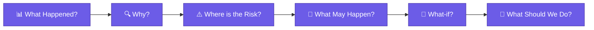
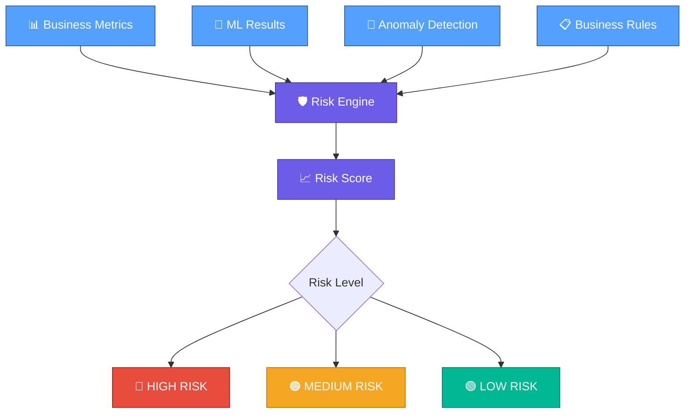
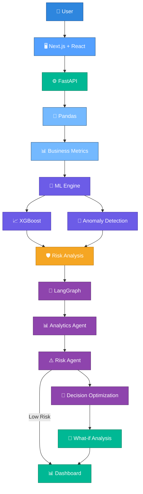

<div align="center">


# 🚀 EVORA — AI Business Intelligence & Decision Optimization System

### Enterprise Vision Optimizing Reasoning Assistant

*Transforming business data into insights, risk awareness, scenario evaluation, and optimized action recommendations.*


<br/>

[](https://www.python.org/)
[](https://fastapi.tiangolo.com/)
[](https://nextjs.org/)
[](https://react.dev/)
[](https://xgboost.readthedocs.io/)
[](https://www.langchain.com/langgraph)


<br/>

### ⚡ From Business Data to Optimized Decisions

</div>

---

> ⚠️ **EVORA does not execute business decisions.**
> It analyzes data, evaluates alternatives, and returns evidence-based recommendations — the final decision always stays with the user.

---

## 📑 Table of Contents

* [Overview](#overview)
* [Project Goal](#project-goal)
* [Core Questions](#core-questions)
* [Key Features](#key-features)
* [AI Agents](#ai-agents)
* [Machine Learning vs AI Agents](#machine-learning-vs-ai-agents)
* [Risk Analysis](#risk-analysis)
* [Workflow](#workflow)
* [System Architecture](#system-architecture)
* [Technology Stack](#technology-stack)
* [Project Structure](#project-structure)
* [Input Data](#input-data)
* [Business Metrics](#business-metrics)
* [What-if Analysis](#what-if-analysis)
* [Example Walkthrough](#example-walkthrough)
* [Reliability and Limitations](#reliability-and-limitations)
* [Evaluation](#evaluation)
* [Project Status](#project-status)

---

## 🧭 Overview

**EVORA** (Enterprise Vision Optimizing Reasoning Assistant) is an AI-powered **Business Intelligence and Decision Optimization System**.

It analyzes business data, surfaces risks, evaluates possible actions, and recommends the most suitable one based on available evidence.

EVORA combines:

* 📊 Business Intelligence
* 🤖 Machine Learning
* 🚨 Anomaly Detection
* 🧠 Multi-Agent AI
* 🔮 What-if Analysis
* 🎯 Decision Optimization

### The Problem

Businesses generate large volumes of data such as:

`Sales • Revenue • Expenses • Products • Customers • Complaints • Delivery Performance`

A traditional dashboard may show:

> `Sales = ₹1,20,000`

But important questions remain:

* Why did sales decrease?
* Which product or customer is causing the problem?
* Where is the business at risk?
* What might happen next?
* Which action should be taken?
* What if another action is chosen?

### Why EVORA is Different



EVORA goes beyond reporting **what happened** by explaining **why**, identifying **risk**, forecasting **what may happen**, evaluating alternatives, and producing evidence-based recommendations.

---

## 🎯 Project Goal

EVORA's goal is to convert raw business information into a clear, explainable, and optimized recommendation that a human can act on.


---

## ❓ Core Questions

|  #  | Question               | Answered By                    |
| :-: | ---------------------- | ------------------------------ |
|  1  | **What happened?**     | 📊 Analytics Agent             |
|  2  | **What is wrong?**     | ⚠️ Risk Agent                  |
|  3  | **What may happen?**   | 🤖 Machine Learning            |
|  4  | **What should we do?** | 🎯 Decision Optimization Agent |

---

## 🚀 Key Features

<table>
<tr>
<td width="50%" valign="top">

### 📊 Business Intelligence

* CSV / Excel upload
* Validation & preprocessing
* Revenue, expense, profit & margin metrics
* Product contribution
* Customer contribution

### 🤖 Machine Learning

* XGBoost-based prediction
* Quantitative forecasting
* Data-driven future estimates

### 🚨 Anomaly Detection

* Isolation Forest
* Unusual pattern detection
* Risk-oriented anomaly signals

</td>

<td width="50%" valign="top">

### 🧠 Multi-Agent AI

* Analytics Agent
* Risk Agent
* Decision Optimization Agent
* LangChain
* LangGraph

### 🔮 What-if Analysis

* Test hypothetical scenarios
* Compare alternatives
* Evaluate impact
* Support better decisions

### 📚 RAG / Knowledge Retrieval

* Ask EVORA
* Business knowledge retrieval
* Sentence Transformers + FAISS

</td>
</tr>
</table>

---

# 🧠 AI Agents

## 📊 Analytics Agent

### *"What happened?"*

Analyzes:

`Sales • Revenue • Expense • Customers • Products`

and converts business trends into understandable insights.

> 💬 **Example:**
> "Sales decreased by 12% during the last period."

---

## ⚠️ Risk Agent

### *"What is wrong?"*

Interprets:

`Metrics + ML Results + Anomalies + Business Context`

to identify risky products, customers, and negative patterns.

> 💬 **Example:**
> "High business risk detected due to increasing complaints and delivery delays."

---

## 🎯 Decision Optimization Agent

### *"Which action is most suitable?"*

Combines:

```text
📊 Analytics
      +
🤖 ML Prediction
      +
⚠️ Risk Analysis
      +
🔮 What-if Scenarios
      ↓
🎯 Optimized Recommendation
```

> 💬 **Example:**
> "Investigate delayed deliveries and high-risk customer segments before increasing marketing expenditure."

**The Decision Optimization Agent recommends an action. It does not automatically execute the business decision.**

---

# 🤖 Machine Learning vs AI Agents

| Machine Learning      | AI Agents        |
| --------------------- | ---------------- |
| Quantitative analysis | Interpretation   |
| Finds patterns        | Explains results |
| Prediction            | Reasoning        |
| Anomaly detection     | Recommendation   |

### Simple Concept

```text
🤖 MACHINE LEARNING
        ↓
Find Patterns
        ↓
Make Predictions
        ↓
Detect Anomalies
        │
        ▼
🧠 AI AGENTS
        ↓
Interpret Results
        ↓
Understand Business Context
        ↓
Reason About Risk
        ↓
Recommend Action
```

---

# ⚠️ Risk Analysis

EVORA combines multiple analysis layers to generate an interpretable risk score.



### Risk Calculation

```text
📊 Business Metrics
        +
🤖 ML Results
        +
🚨 Anomaly Detection
        +
📋 Business Rules
        ↓
   📈 Risk Score
        ↓
   ⚠️ Risk Level
```

> Risk scores are decision indicators, not guaranteed probabilities.

---

# 🔄 Workflow

## 🚀 Complete EVORA Pipeline

```mermaid
flowchart LR

    A["📥 CSV / Excel"] --> B["🧹 Preprocessing"]
    B --> C["📊 Business Metrics"]

    C --> D{"🤖 ML Engine"}

    D --> P["📈 Prediction"]
    D --> AD["🚨 Anomaly"]

    P --> R["🛡️ Risk"]
    AD --> R

    R --> LG["🧠 LangGraph"]

    LG --> AN["📊 Analytics"]
    AN --> RA["⚠️ Risk Agent"]
    RA --> DO["🎯 Decision"]

    DO --> WI["🔮 What-if"]
    WI --> REC["✅ Recommendation"]

    REC --> USER["👤 Human Decision"]

    classDef input fill:#2E86DE,stroke:#1B4F91,color:#fff
    classDef process fill:#54A0FF,stroke:#2E5C8A,color:#fff
    classDef ml fill:#6C5CE7,stroke:#4834A6,color:#fff
    classDef risk fill:#F5A623,stroke:#B9770E,color:#fff
    classDef agent fill:#8E44AD,stroke:#5B2C6F,color:#fff
    classDef output fill:#00B894,stroke:#00795A,color:#fff

    class A input
    class B,C,WI process
    class D,P,AD ml
    class R risk
    class LG,AN,RA,DO agent
    class REC,USER output
```



### ⚡ Animated-Style Workflow

```text
📂 DATA
  │
  ▼
⚙️ PREPROCESSING
  │
  ▼
📊 ANALYTICS
  │
  ├───────────────┐
  ▼               ▼
🤖 ML          🚨 ANOMALY
  │               │
  └───────┬───────┘
          ▼
      ⚠️ RISK
          │
          ▼
      🧠 AGENTS
          │
          ├── 📊 Analytics
          │
          ├── ⚠️ Risk
          │
          └── 🎯 Decision
                  │
                  ▼
             🔮 WHAT-IF
                  │
                  ▼
             💡 ACTION
                  │
                  ▼
             👤 HUMAN
```

---

# 🏗️ System Architecture



### 🧩 Architecture Layers

```text
┌─────────────────────────────────────┐
│         👤 PRESENTATION             │
│       Next.js + React               │
└─────────────────┬───────────────────┘
                  ↓
┌─────────────────────────────────────┐
│          ⚙️ BACKEND                 │
│             FastAPI                 │
└─────────────────┬───────────────────┘
                  ↓
┌─────────────────────────────────────┐
│        📊 DATA PROCESSING            │
│        Pandas + NumPy               │
└─────────────────┬───────────────────┘
                  ↓
┌─────────────────────────────────────┐
│          🤖 ML LAYER                │
│      XGBoost + Anomaly Detection    │
└─────────────────┬───────────────────┘
                  ↓
┌─────────────────────────────────────┐
│        ⚠️ RISK LAYER                │
│     Metrics + ML + Anomalies        │
└─────────────────┬───────────────────┘
                  ↓
┌─────────────────────────────────────┐
│        🧠 AGENT LAYER               │
│ Analytics → Risk → Decision         │
└─────────────────┬───────────────────┘
                  ↓
┌─────────────────────────────────────┐
│        🔮 DECISION LAYER            │
│      What-if + Recommendation       │
└─────────────────┬───────────────────┘
                  ↓
┌─────────────────────────────────────┐
│          👤 HUMAN                   │
│       Final Decision                │
└─────────────────────────────────────┘
```

---

# 🛠️ Technology Stack

| Category            | Technologies                 |
| ------------------- | ---------------------------- |
| 🐍 Language         | Python                       |
| 🧮 Data Processing  | Pandas, NumPy                |
| 🤖 Machine Learning | Scikit-learn, XGBoost        |
| 🧠 Agentic AI       | LangChain, LangGraph         |
| 💬 LLM              | Groq                         |
| 🔎 Retrieval        | Sentence Transformers, FAISS |
| ⚙️ Backend          | FastAPI                      |
| 🗄️ Database        | SQLite                       |
| 🖥️ Frontend        | Next.js, React               |
| 🔧 Version Control  | Git, GitHub                  |

### Planned Frontend Pages

`Dashboard · Business Analysis · ML Predictions · Anomaly & Risk · AI Recommendations · What-if Analysis · Ask EVORA · Reports`

---

# 📁 Project Structure

```text
EVORA/
│
├── backend/        → FastAPI application & API endpoints
├── frontend/       → Next.js + React interface
├── ml/             → XGBoost models & anomaly detection
├── agents/         → Analytics, Risk & Decision Optimization agents
├── rag/            → Knowledge retrieval (FAISS + embeddings)
├── data/           → Sample & uploaded business datasets
├── tests/          → Test suite
└── README.md
```

---

# 📥 Input Data

EVORA works from uploaded CSV or Excel business data.

| Field            | Description                   |
| ---------------- | ----------------------------- |
| Date             | Transaction or reporting date |
| Product          | Product or service name       |
| Category         | Product category              |
| Quantity         | Units sold                    |
| Revenue          | Revenue generated             |
| Expense          | Associated cost               |
| Customer         | Customer identifier           |
| Customer Segment | Customer grouping / segment   |
| Complaints       | Number of complaints logged   |
| Delivery Delay   | Delivery delay indicator      |

> Not every dataset needs every field — EVORA works with the columns available in the uploaded file.

---

# 📊 Business Metrics

* 💰 Revenue
* 💸 Expenses
* 📈 Profit
* 📊 Profit Margin
* 📉 Sales Growth
* 🏷️ Product Contribution
* 👥 Customer Contribution

---

# 🔮 What-if Analysis

EVORA lets users test hypothetical business decisions before making them.

> 💬 **Example:**
> *"What if Product A's price increases by 10%?"*


### 🔮 Scenario Flow

```text
📌 CURRENT
    │
    ▼
🔄 ALTERNATIVE
    │
    ▼
📊 IMPACT
    │
    ▼
⚠️ RISK
    │
    ▼
🎯 RECOMMENDATION
```

Scenario results are estimates based on available data and stated assumptions — not guaranteed forecasts.

---

# 🧪 Example Walkthrough

### Business Snapshot

| Metric         |  Change |
| -------------- | ------: |
| Sales          | 🔻 -12% |
| Complaints     | 🔺 +18% |
| Delivery Delay | 🔺 +15% |
| Expenses       | 🔺 +21% |

### EVORA Reasoning

```text
📊 ANALYTICS
Sales performance declined significantly.
             ↓
🤖 MACHINE LEARNING
High likelihood of continued sales weakness.
             ↓
⚠️ RISK AGENT
High business risk due to rising expenses
and delivery delays.
             ↓
🎯 DECISION OPTIMIZATION
Investigate delayed deliveries and high-risk
customer segments before increasing marketing spend.
```

### What-if Question

> **"What if Product A's price increases by 10%?"**

```text
Question
   ↓
🔮 Scenario Creation
   ↓
📊 Impact Analysis
   ↓
⚠️ Risk Evaluation
   ↓
🎯 Recommended Option
```

---

# 🛡️ Reliability and Limitations

EVORA is a **recommendation system**, not an autonomous execution system.

Every recommendation is expected to carry:

* A clear reason
* A supporting metric
* Evidence
* An associated risk
* A confidence level

When data is inadequate:

> **"Insufficient evidence for a strong recommendation."**

If Groq is unavailable, the ML and business-rule layers can continue working independently, falling back to a basic rules-based recommendation.

### Known Limitations

* Recommendation quality depends on uploaded data quality
* ML predictions are estimates, not guarantees
* Anomaly detection may need human verification
* What-if results depend on assumptions and available data
* LLM-generated explanations may require validation
* Risk scores are indicators, not guaranteed probabilities

> **EVORA's role ends at the recommendation — executing the decision is always left to the user.**

---

# 📏 Evaluation

### 🧮 Machine Learning

`MAE` · `RMSE` · `MAPE` · `Precision` · `Recall` · `F1`

### 🤖 AI Agents

* Insight correctness
* Recommendation relevance
* Evidence correctness
* Unsupported-recommendation rate

### ⚙️ System

* Response time
* Token usage
* Agent calls
* Retrieval time

---

# 🚧 Project Status

**Under Active Development**

EVORA is being built in stages, starting with the core CSV-to-dashboard data flow.

```text
📊 Business Intelligence
          ↓
🤖 Machine Learning
          ↓
🚨 Anomaly Detection
          ↓
🧠 Multi-Agent AI
          ↓
📚 RAG
          ↓
🔮 What-if Analysis
          ↓
🎯 Decision Optimization
```

---

<div align="center">

### 🚀 EVORA — From Business Data to Optimized Decisions.

<br/>

[](https://github.com/kedar765/EVORA)

<br/><br/>


</div>
